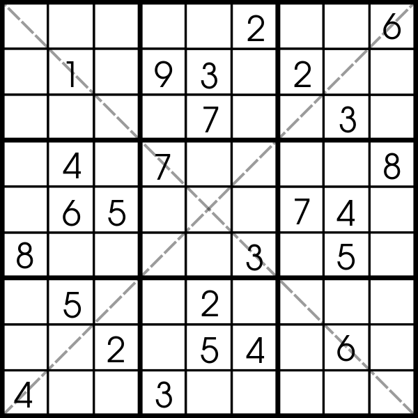

# sudoku_solver

## Project motivation
This project is one small step for man but could be a giant leap for mankind. In increasing our productivity as many people will not have to spend day by day with solving sudoku anymore. I did this project as part of Udacity, Artificial Intelligence Nanodegree.

## Project description
In this project, I've implemented an algorithm to solve diagonal sudoku.

First, the algorithm runs `Constraint Propagation`:
1. `Elimination strategy` is applied. If a box has a value assigned, then none of the peers (in the given row, the column, and the subsquare) of that box can have the same value
2. `Only-choice strategy` is applied. If only one box in a unit allows a certain digit, then that box is assigned that digits
3. Eliminate `naked-twins strategy` is applied. If we have two or more unallocated boxes in a unit and there are only two digits that can go in those two boxes, then those two digits can be eliminated from the possible assignments of all other boxes in the same unit
4. Return to the first step on updated sudoku field (as long as there is a progress)

Second, after the number of possible solutions were reduced (and search space), the `Depth First Search` is applied.

The output is solved diagonal sudoku grid.

### About sudoku
Sudoku consists of a 9x9 grid. The objective is to fill the grid with digits in such a way that each row, each column, and each of the 9 principal 3x3 subsquares contains all of the digits from 1 to 9. The detailed rules can be found for example [here](https://www.conceptispuzzles.com/index.aspx?uri=puzzle/sudoku/rules).

## Usage
1. Run `solutions.py`, the predefined sudoku will be solved
2. Assign your sudoku to variable `diag_sudoku_grid` in format  = `2.............62....1....7...6..8...3...9...7...6..4...4....8....52.............3` where `.` represents unknown fields
3. Run `solutions.py` for your sudoku
4. Enjoy the free time you would otherwise spend by solving the sudoku yourself

## Libraries used
Python 3
- Optional: pygame

## Files in the repository
- `solutions.py`: contains the algorithm for solving sudoku
- `utils.py`: contains auxiliary functions for the algorithm
- `solution_test.py`: contains two sudokus with their solutions against which is the algorithm tested
- `PySudoku.py`: contains (optional)visualization using `pygame` library 

 
